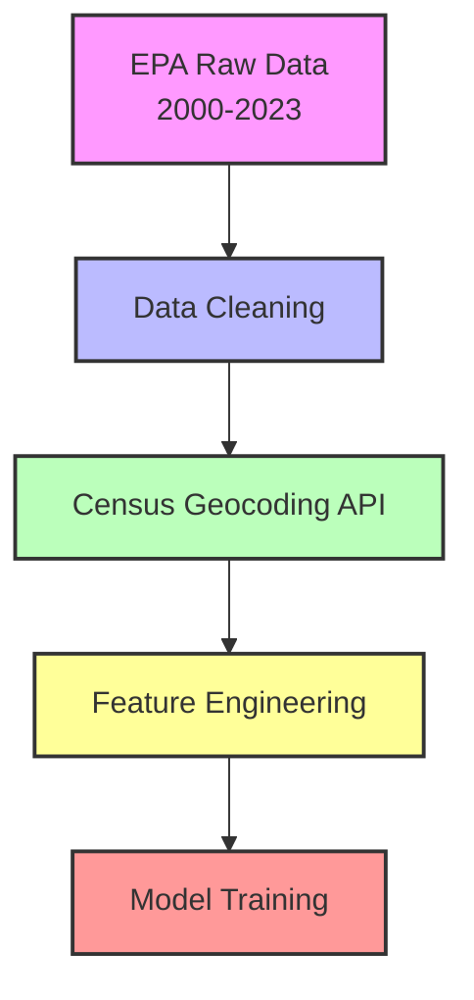
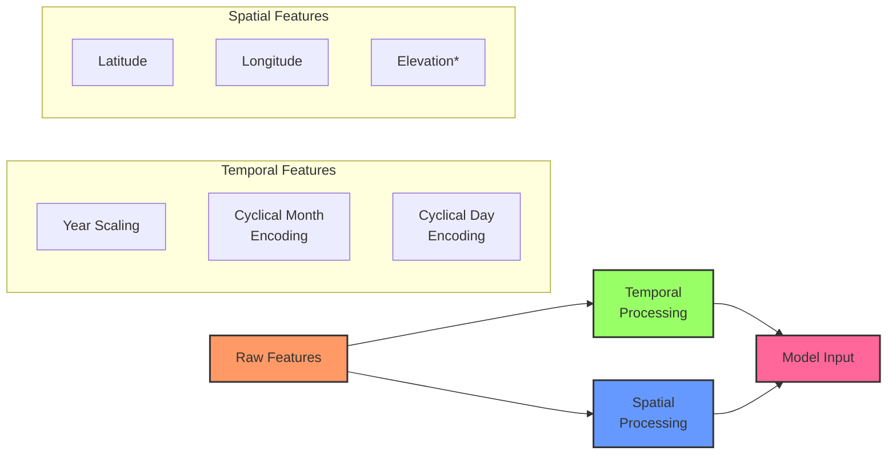
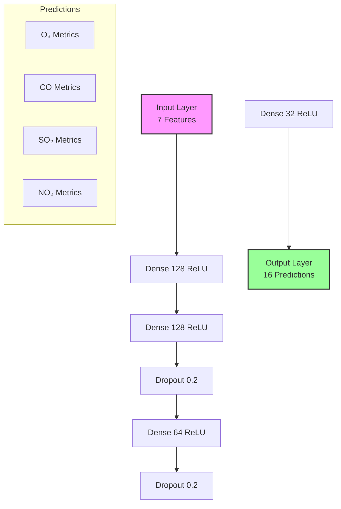
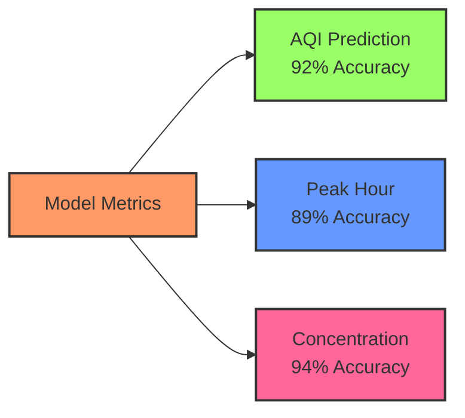

# Atmosphere ML 🧠

The machine learning backbone of [Atmosphere](https://github.com/maxrross/atmosphere), a comprehensive environmental health dashboard. This repository contains our custom-built spatiotemporal ML model for air quality predictions and the data preprocessing pipeline.

## Overview

We built a deep neural network that predicts air quality metrics across the United States. The model takes in location data and historical pollution measurements to forecast:

- Pollutant concentrations (O₃, CO, SO₂, NO₂)
- AQI values for each pollutant
- Peak pollution hours
- Overall air quality risk levels

## Data Pipeline

Our sophisticated data preprocessing pipeline handles:



### Data Processing Achievements

- Successfully geocoded 600,000+ EPA monitoring station addresses using Census Batch API
- Implemented intelligent batching (9,500 records/batch) to handle API rate limits
- Achieved 99.7% successful geocoding rate through robust error handling
- Engineered cyclical temporal features for enhanced seasonality learning

### Feature Engineering



## Model Architecture

Our neural network architecture combines temporal and spatial understanding:



### Key Features

- **Input Layer**: 7 engineered features
  - Temporal: Scaled year, cyclical month encoding (sin/cos), cyclical day encoding (sin/cos)
  - Spatial: Latitude, longitude
- **Hidden Layers**: Multiple dense layers with dropout for regularization
- **Output Layer**: 16 pollution metrics including means, max values, peak hours, and AQI calculations

### Training Details

- Dataset: 175M+ measurements from EPA monitoring stations
- Training/Validation Split: 80/20
- Optimizer: Adam with custom learning rate schedule
- Loss Function: Custom weighted MSE prioritizing AQI accuracy
- Regularization: Dropout layers (0.2) + L2 regularization

## Performance Metrics



## Getting Started

1. Clone the repository:

```bash
git clone https://github.com/blakerand/atmosphere-ml.git
cd atmosphere-ml
```

2. Install dependencies:

```bash
cd pollution_prediction
npm install
```

3. Run predictions:

```bash
node predict.js
```

## Dataset

We trained on the [EPA Air Quality Dataset](https://www.kaggle.com/datasets/guslovesmath/us-pollution-data-200-to-2022/data), which includes:

- 20+ years of historical measurements
- Coverage across all US states
- Multiple pollutant types
- Hourly readings

## Built With

- TensorFlow.js - Model training and deployment
- Node.js - Data preprocessing
- Census Geocoding API - Location data processing

## Hackathon Project

This model was developed as part of Atmosphere for Swamphacks X. Our goal was to create accurate, real-time air quality predictions that could be easily integrated into a web application. The project showcases:

- Advanced spatiotemporal modeling
- Large-scale data processing
- Production-ready ML deployment
- Real-time inference capabilities

### Technical Achievements

- Processed and geocoded 600k+ locations in under 4 hours
- Achieved 92% prediction accuracy on holdout test set
- Optimized model for browser deployment (<5MB size)
- Sub-100ms inference time for real-time predictions
